# Plum Claims Processing System

A multi-agent AI-powered health insurance claims processing pipeline that automates claim adjudication with full explainability, role-based access, and admin override workflows.

## Architecture

### System Flow — Member Claim Submission to Decision



A member submits a claim through the Next.js frontend. The FastAPI backend accepts the submission, immediately returns an "Under Review" status, and processes the claim asynchronously through a 4-agent pipeline (Document Validator → Extraction Agent → Fraud Detector → Adjudicator). Each agent writes a trace step. The member sees only the final decision status; the full trace is visible to admins.

### Admin Manual Review Flow



When the pipeline produces a `MANUAL_REVIEW` decision (fraud signals, high-value claims, or component failures), a Resend email alerts the admin with claim details and a direct dashboard link. The admin reviews the full trace, overrides the decision (approve/reject), and the member sees the updated status in their portal.

---

## Quick Start

### Prerequisites
- Python 3.11+
- Node.js 20+

### Setup & Run

**Terminal 1 — Backend:**
```bash
cd backend
python -m venv venv
source venv/bin/activate
pip install -r requirements.txt
uvicorn main:app --host 0.0.0.0 --port 8000 --reload
```

**Terminal 2 — Frontend:**
```bash
cd frontend
npm install
npm run dev
```

Open http://localhost:3000 in your browser.

### Environment Variables

| Variable | Purpose | Required |
|----------|---------|----------|
| `GROQ_API_KEY` | Groq API for LLM-powered extraction (Llama 3.3 70B) | Optional (falls back to rule-based) |
| `RESEND_API_KEY` | Email notifications via Resend | Optional |
| `ADMIN_EMAIL` | Recipient for manual review alerts | Optional |
| `JWT_SECRET` | JWT signing secret | Optional (has default) |

### Run Tests
```bash
cd backend
source venv/bin/activate
python -m pytest tests/ -v
```

All 12 test cases from `test_cases.json` pass (12/12).

---

## Multi-Agent Pipeline

```
                    ┌─────────────────────┐
                    │   Claim Submission   │
                    └──────────┬──────────┘
                               │
                    ┌──────────▼──────────┐
                    │  Document Validator  │──── STOP → Specific error to member
                    └──────────┬──────────┘
                               │ PASS
                    ┌──────────▼──────────┐
                    │  Extraction Agent    │──── Uses Groq LLM (Llama 3.3 70B)
                    └──────────┬──────────┘
                               │
                    ┌──────────▼──────────┐
                    │   Fraud Detector     │──── FLAG → routes to MANUAL_REVIEW
                    └──────────┬──────────┘
                               │ PASS
                    ┌──────────▼──────────┐
                    │    Adjudicator       │──── Policy engine (policy_terms.json)
                    └──────────┬──────────┘
                               │
                    ┌──────────▼──────────┐
                    │      Decision        │
                    │  APPROVED | PARTIAL  │
                    │  REJECTED | MANUAL   │
                    └─────────────────────┘
```

Each agent produces a trace step explaining what it checked and what it found. The orchestrator catches failures per-stage, reduces confidence, and continues — the system never crashes.

---

## Key Features

- **Multi-agent architecture** — 5 specialized agents (Orchestrator + 4 pipeline stages) with clear interfaces
- **Full explainability** — every decision includes a step-by-step trace with check-level detail
- **Graceful degradation** — component failures don't crash the system; confidence is reduced and manual review is recommended
- **Specific error messages** — document problems get actionable, named feedback (not generic errors)
- **Policy-driven** — all rules read from `policy_terms.json`, zero hardcoded values
- **Role-based access** — JWT auth with member/admin roles; members can only see their own claims
- **Admin override workflow** — email notifications via Resend, dashboard with full traces, one-click overrides
- **Async processing** — claims processed in background threads; immediate "Under Review" response to member
- **Fraud detection** — same-day claim limits, monthly frequency, high-value thresholds, multi-provider detection

---

## Tech Stack

| Layer | Technology | Rationale |
|-------|-----------|-----------|
| Backend | Python + FastAPI | Async, type-safe (Pydantic), excellent for LLM integration |
| Frontend | Next.js (React + TypeScript) | Member portal + admin dashboard in one app |
| LLM | Groq (Llama 3.3 70B) | Fast inference, vision-capable, free tier |
| Database | SQLite (WAL mode) | Zero config, sufficient for demo scale |
| Auth | JWT (PyJWT) | Stateless, role-based (member/admin) |
| Email | Resend | Manual review notifications to admin |

---

## Project Structure

```
claims-processor/
├── backend/
│   ├── main.py                  # FastAPI app — routes, auth, async processing
│   ├── models.py                # Pydantic data models (ClaimSubmission, ClaimDecision, etc.)
│   ├── policy_engine.py         # Reads policy_terms.json — zero hardcoded rules
│   ├── llm_service.py           # Groq LLM wrapper (Llama 3.3 70B)
│   ├── database.py              # SQLite setup, queries, member management
│   ├── auth.py                  # JWT token creation/verification, role checks
│   ├── email_service.py         # Resend email notifications
│   ├── policy_terms.json        # Policy configuration (coverage, limits, exclusions)
│   ├── test_cases.json          # 12 test scenarios
│   ├── agents/
│   │   ├── orchestrator.py      # Pipeline coordinator — failure isolation
│   │   ├── document_validator.py # Doc completeness, quality, patient consistency
│   │   ├── extraction.py        # Structured data extraction (LLM + rule-based)
│   │   ├── fraud_detector.py    # Pattern-based anomaly detection
│   │   └── adjudicator.py       # Policy rule application (strict check order)
│   └── tests/
│       └── ...
├── frontend/
│   └── app/
│       ├── page.tsx             # Member portal (login, claim form, status)
│       ├── admin/page.tsx       # Admin dashboard (queue, traces, overrides)
│       └── components/
│           ├── ClaimForm.tsx     # Claim submission with document upload
│           └── DecisionView.tsx  # Decision card + trace viewer
├── docs/
│   ├── ARCHITECTURE.md          # System design, trade-offs, scaling
│   ├── COMPONENT_CONTRACTS.md   # Interface specifications for each agent
│   ├── EVAL_REPORT.md           # All 12 test case results with traces
│   ├── claims_architecture_member_decision_only.svg
│   └── admin_manual_review_flow_no_member_email.svg
└── Makefile
```

---

## API Endpoints

### Public (authenticated)
| Endpoint | Method | Description |
|----------|--------|-------------|
| `/api/auth/login` | POST | Member login (returns JWT) |
| `/api/claims` | POST | Submit a claim for processing |
| `/api/claims/{id}` | GET | Get claim status (own claims only) |
| `/api/claims` | GET | List own claims |
| `/api/policy/members` | GET | List policy members |
| `/api/policy/categories` | GET | List claim categories |
| `/api/policy/hospitals` | GET | List network hospitals |
| `/api/health` | GET | Health check |

### Admin (requires admin auth)
| Endpoint | Method | Description |
|----------|--------|-------------|
| `/api/admin/login` | POST | Admin login (returns JWT) |
| `/api/admin/claims` | GET | List all claims with full details |
| `/api/admin/claims/{id}` | GET | Full claim decision with trace |
| `/api/admin/claims/{id}/override` | POST | Override a decision (approve/reject) |
| `/api/admin/stats` | GET | Dashboard statistics |
| `/api/run-test-suite` | POST | Run all 12 test cases |

---

## Documentation

- [Architecture Document](docs/ARCHITECTURE.md) — system design, trade-offs, scaling strategy
- [Component Contracts](docs/COMPONENT_CONTRACTS.md) — input/output specs for each agent
- [Eval Report](docs/EVAL_REPORT.md) — all 12 test case results with traces
